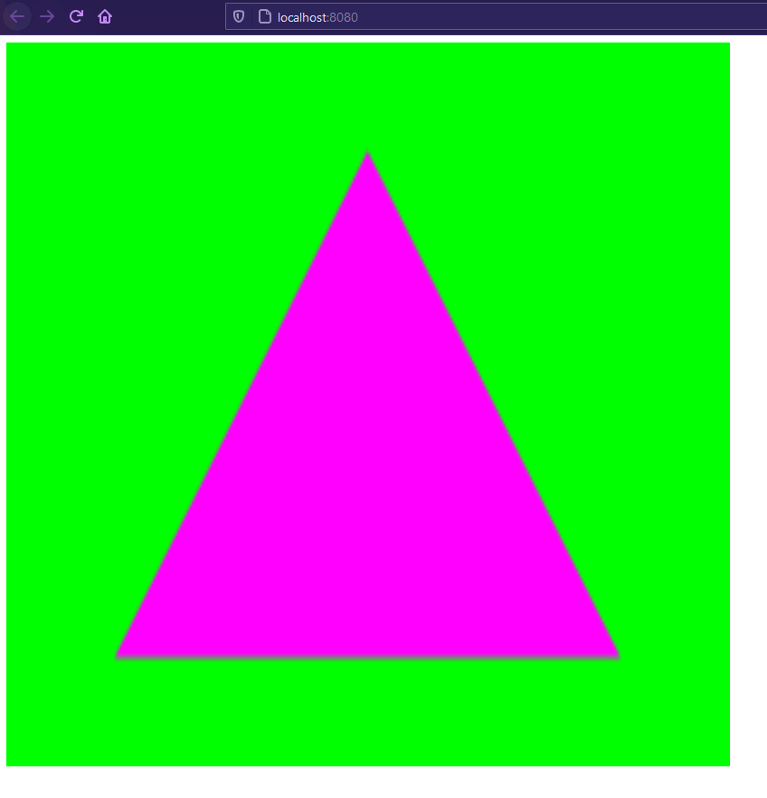

# Rusty Shit Box
I wanted to learn rust, and I wanted to learn web assembly as well as stretch my legs with Web GL. 
So I decided to make a simple 2D rendering engine for a car game I wanted to make. 

Will it be complete ever? Probably not

Will it be good? The game or the engine? Doesn't matter the answer is no for both 

I don't have a bunch of free time so this is just a I'm bored and need somthing to do project/


## How to build
You'll need the following installed
*   Rust Nightly
*   wasm-pack
*   Node/NPM (version 14.x.x)

```bash
# Compile to web assembly
cd rusty-shit-box
wasm-build pack

# Run the webserver
cd web
# If you haven't ran it before
npm install
npm start
```

Navigate to [localhost:8080](http://localhost:8080)

And then you should see triangle with a color palette that would make even the Hulk upset
